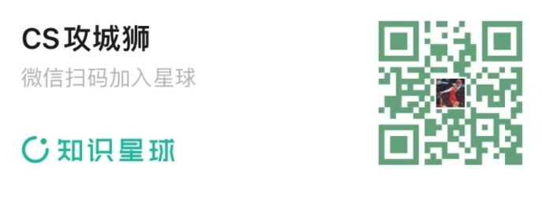

  
## 目录

---

### 1. 算法面经
- 算法/深度学习/NLP面试笔记 
- 算法工程师面试
- 2019届秋招面经集合 
- 技术面试必备基础知识
- AI算法岗求职攻略 
- 阿里、腾讯、百度、华为、京东、搜狗和滴滴最新面试题汇集
- 「面试算法练级攻略」-「LeetCode题解」-「剑指offer题解」
- MVision-awesome 
- 算法实习岗位信息表，部分包括内推码，和常见深度学习算法岗面试题及答案，暑期计算机视觉实习面经和总结
- Daily Interview 
- 最新总结，阿里，腾讯，百度，美团，头条等技术面试题目，以及答案，专家出题人分析汇总
- CV岗常见面试题 
- 计算机视觉算法岗知识点及面试问答汇总
- awesome-computer-vision 
- 互联网公司leetcode题目 
- Algorithm_for_Interview-Chinese 
- apachecn Interview 

### 2. 大厂面经
- 旷视19届春招-算法研究员
- [腾讯算法实习面试总结 ](https://t.zsxq.com/TGWN8)
- [春招详细算法面经(旷视/海康/联影等8家公司Offer)](https://articles.zsxq.com/id_7z112lh4f2f6.html)
- [普通的算法/机器学习面经](https://articles.zsxq.com/id_lww01m3if3e2.html)
- 视觉算法-暑期实习 
- 字节跳动实习算法岗面经 
- 阿里腾讯虎牙机器学习算法面经 
- 字节跳动图形图像算法实习面经 
- 拼多多算法实习生面经 
- 算法岗面经传送门 
- 面经（腾讯AI Lab，阿里达摩院，华为等公司大集合） 
- cv岗面经 
- 小菜鸡的算法实习面经 
- 机器学习/算法校招面试考点汇总 
- 计算机视觉暑期实习面经 
- 算法岗面经（阿里云,1,2,3，交叉，hr面） 
- 春招实习面经（cv算法岗） 
- 双非本硕算法陪跑面经 
- 春招科大讯飞，华为，神策数据，今日头条面经 
- 届渣硕春招实习总结-算法岗（计算机视觉）
- 爱奇艺深度学习算法实习生面经 
- 阿里，旷视，亚马逊，谷歌面经 
- 算法菜鸟的春招之路 
- 机器学习算法面经（腾讯阿里网易） 
- 实习算法岗血泪面经，商汤，旷世，阿里，字节跳动
- 机器学习/数据挖掘岗2019秋招总结 
- 算法面经（阿里、腾讯、美团等）
- 春招秋招算法机器学习岗面经（阿里、腾讯、美团、携程） 
- 春招（附面经）
- 计算机视觉算法岗面经 
- 机器学习算法面经---2018秋招 
- 阿里&腾讯春招算法面经
- 阿里暑期实习六面面经 
- 计算机视觉算法岗面经
- 阿里 达摩院 cv 算法 面经
- 算法工程师面经 寒拼蘑腾作网网3 附答案 
- 搜狗算法面经 
- 商汤20校招CV算法研究员面经(三面+HR面) 
- 作业帮/寒武纪/商汤/科大讯飞面经
- 面经 | 腾讯/百度/字节跳动/拼多多/华为/美团/寒武纪/虎牙等 
- 算法秋招上岸了，大家加油，我先撤了（附所有面经）
- 秋招小结：感受+面经（CV算法岗）
- 面经（腾讯AI Lab，阿里达摩院，华为等公司大集合）
- 秋招小结：感受+面经（CV算法岗） - 09.07
- 阿里巴巴达摩院 CV 四轮算法面经 
- 秋招小结：感受+面经（CV算法岗）- 09.26 
- 计算机视觉实习生面试经验（腾讯/头条/商汤/旷视/达摩院等）
- 秋招 | 谷歌，微软，阿里，腾讯，百度等算法岗 
- 微软、Hulu、Amazon、腾讯、百度、网易、美团、华为等18家公司SP Offer面经
- 面经 | 商汤科技计算机视觉岗【二面】 
- 面经 | 阿里巴巴达摩院 CV 四轮算法面经 
- 面经 | 百度、美团、拼多多、寒武纪等互联网大厂面试经验
- 面经 | 旷视科技算法研究员面经 
- 18家算法面经汇总 
- 一个双非渣硕的自我救赎之路 
- 算法面经 | 微软/阿里/百度/字节跳动/华为/OPPO 

- 算法工程师必须要知道的面试技能雷达图
- 做计算机视觉的你，如何拿到大厂的Offer的？可否分享下？
- 字节跳动计算机视觉算法实习生视频面试
- 2019秋招算法面经
- CVTE视觉计算岗实习面经
- 互联网公司最常见的面试算法题有哪些？ 
- 计算机视觉（cv）方向今年招聘情况怎么样?是否已经人才过剩?
- 校招-基础算法图像处理算法 
- 深度学习算法工程师面经 
- 小米面试总结 
- 百度/商汤AI面试 
- 算法校招经验总结(百度,阿里巴巴,腾讯,今日头条) 
- 海外小硕的国内面试经历
- 致未来的算法工程师-算法校招经验总结（百度，阿里巴巴，腾讯，今日头条）

  
## C/C++
- C/C++面试基础知识总结
- 常见C++笔试面试题整理
- C/C++问题总结 
- 面试高频算法题总结
- Algorithm for Interview（面试算法笔记-中文）
- leetcode 1~400知识点&题型总结&leetcode对应题表
- C++解决问题第七版

---
  
## Python
- 关于Python的面试题1
- 关于Python的面试题2
- 剑指offer（python版）/ 算法图解 / python基础 / 数据结构 
- 算法面试题python
- Python面试都在这里了【315+道题】

---

## 更多交流和学习
